# Hamptons Hospital Electronic Health Records System User Manual

Hi, and welcome to the Hamptons Hospital Electronic Health Records (EHR) System
User Manual! If you want to help improve this manual, [create a github
account](https://github.com/join) if you don't already have one, sign in to
[github](https://github.com/), then go
[here](https://github.com/JasonMFry/hamptons_hospital_ehr_user_manual/edit/master/user_manual.md),
make changes, and finally click "Propose File Change" at the bottom of the
page.

This user manual is for all members of the Hamptons Hospital who need to use
the EHR system. Our EHR is powered by [OpenMRS](https://openmrs.org/), and this
user manual is largely based on OpenMRS' [user
manual](https://wiki.openmrs.org/display/docs/Using+the+Reference+Application).

## Table of Contents

- [Hamptons Hospital Electronic Health Records System User
  Manual](#hamptons-hospital-electronic-health-records-system-user-manual)
  - [Table of Contents](#table-of-contents)
  - [Getting Started](#getting-started)
    - [Logging In](#logging-in)
    - [Changing Your Password](#changing-your-password)
    - [Forgot Your Password?](#forgot-your-password)
    - [Updating Your Personal Profile](#updating-your-personal-profile)
  - [Registering and Scheduling Patients](#registering-and-scheduling-patients)
    - [Creating a Patient](#creating-a-patient)
    - [Editing a Patient's Information](#editing-a-patients-information)
    - [Patient Overview screen](#patient-overview-screen)
    - [Scheduling an Appointment](#scheduling-an-appointment)
    - [Checking in a Patient](#checking-in-a-patient)
    - [Receiving Payment](#receiving-payment)
  - [Caring for Patients](#caring-for-patients)
    - [Capturing Vitals](#capturing-vitals)

## Getting Started

Before you can use the EHR system, you'll need to login. Below is everything
you need to know to log in, change your password, help if you forget your
password, and log out.

### Logging In

Before you can log in to the EHR you need someone else to create a username and
password for you. Your supervisor should know who to ask to create a user for
you, if you don't already have one.

Once you have a username and password, navigate to [the login
page](http://10.0.0.41:8080/openmrs/login.htm), input your username and
password, select a location (some locations have access to certain information
and actions that other locations don't, so pick the location that most closely
corresponds to where you are), and click "Log In".

### Changing Your Password

The first thing you should do after logging is to change your password. Please
protect our patients, our co-workers, and our hospital by choosing a strong
password. I highly recommend navigating to [random word
generator](https://randomwordgenerator.com/) and let it generate 3-5 random
words for you as your password.

To change your password, click on your username. This will create a button
called "My Account", click on that, then click on the large button called
"Change Password". After you have changed your password, you are ready to use
the EHR system!

### Forgot Your Password?

If you forgot your password, that's ok, we can reset it. However, it may take
several hours, so do your best to remember your password.  Unfortunately, our
EHR system does not yet allow non-administrator users to reset their passwords
directly. In order to have your password reset, contact your system
administrator.

Clicking the "Can't Log In?" button on the login screen will display a pop-up
box prompting you to contact your local administrator, which isn't very helpful
:)

After you've had the system administrator reset your password, you should
follow the instructions in [Changing Your Password](#changing-your-password).

### Updating Your Personal Profile

At this time, the only thing you can update in your personal profile is your
password and your preferred language. We've already discussed changing your
password, so if you want to change your language, follow these instructions,
and consult the image in [Changing Your Password](#changing-your-password).

 1. Towards the top right of the page, click on your username next to the
 person icon.
 1. Click ‘My Account’ when it appears in the dropdown.
 1. Change your languages as necessary.

## Registering and Scheduling Patients

This section is focused on staff at the front desk who need to register new
patients, check in a patient when they arrive for their appointment, schedule
future visits, and take payment.

### Creating a Patient

To create a new patient, follow these steps:

 1. Log into the OpenMRS system.
 1. Click on the 'Register a patient' box. If you don't see this box, you may
 not be authorized to register a new patient.  Contact your supervisor.
 1. Enter a name for this new patient, or identify the patient as an
 unidentified patient.
 1. Select a gender for your patient.
 1. Enter in the patient's birth date, or a rough estimate of how old they are.
 1. Enter in the patient's home address.
 1. Enter in the patient's phone number.
 1. Enter in as few or as many of the patient's relatives, including their name
 and relationship.
 1. Click the confirm button on the left side of the screen.
 1. Confirm that your entries are accurate.
 1. Click the green 'Confirm' button and your patient will be written to the
 database.

If you leave a required field blank, you will not be able to move on to the
next section, so make sure you enter something in all the required fields.

### Editing a Patient's Information

This section is about how to edit demographic information about a patient that
already exists in the system, including name, gender, birth date, and contact
information.

First you will need to navigate [home](http://10.0.0.41:8080/openmrs/), which
you can do by clicking the Hamptons Hospital logo in the top left of the
screen, or navigating their directly by going to
http://10.0.0.41:8080/openmrs/. Once you're on the home screen, you should see
a box called Find Patient Record. Click on this box.

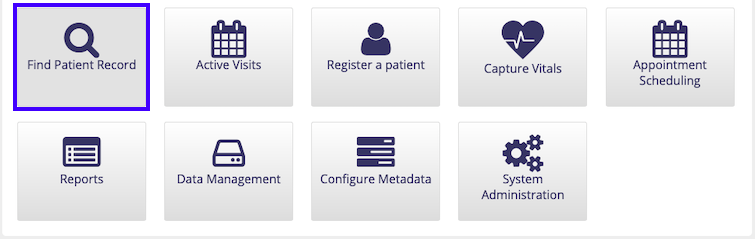

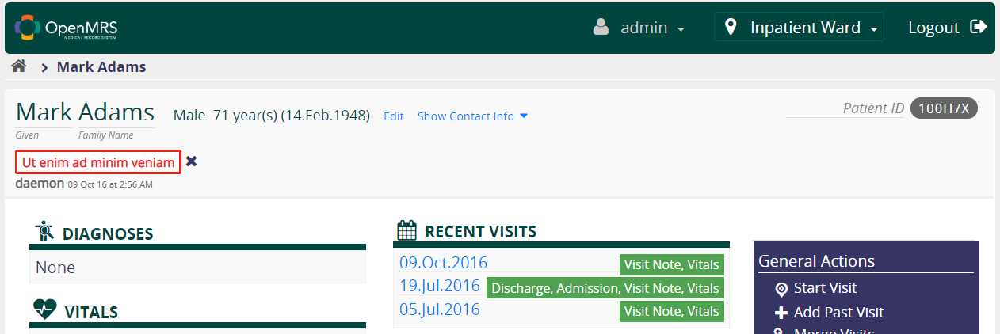

 1. Click on "Edit" next to the patient’s name and date of birth.
 1. You will be taken to the “Demographics” page where you can edit the
 patient’s name, gender, and date of birth.
 1. Edit the patient’s name if desired.
 1. Select  “Gender” from the list under “Demographics” on the left side of the
 page.
 1. Edit the patient’s gender if desired.
 1. Select  “Birthdate” from the list under “Demographics” on the left side of
 the page.
 1. Edit the patient’s birth date or estimated age in years and months if
 desired.
 1. Click “Confirm” at the bottom of the list under “Demographics” on the left
 side of the page.
 1. You will be presented with an overview of the demographic information for
 the patient and given the option to either confirm or cancel the changes.
 1. Click either the “Confirm” button or “Cancel” button to finish editing the
 patient’s demographics and return to the patient overview screen.

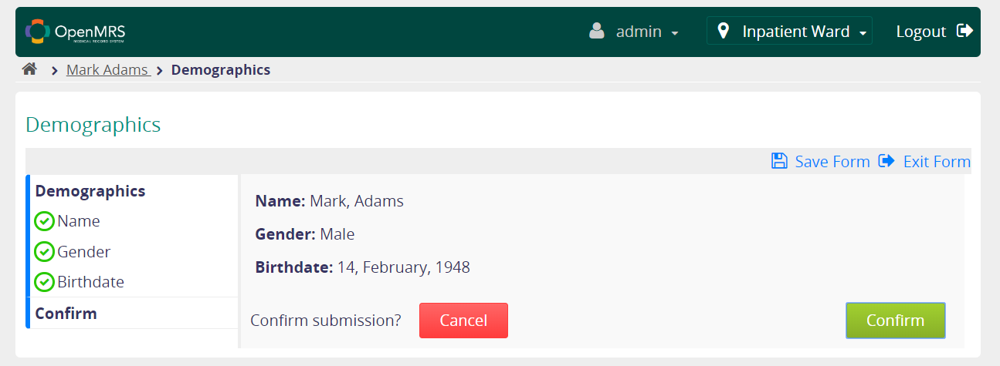

Note: The “Save Form” and “Exit Form” buttons can be used to close the form at
any time.

Editing Contact Information:

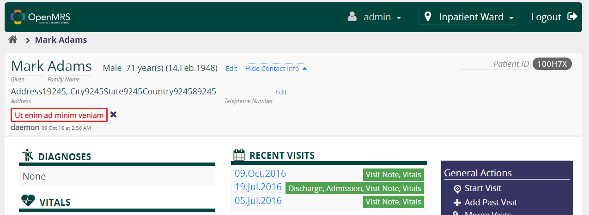

 1. Click on "Show Contact Info" next to the patient’s name and date of birth.
 1. The patient information section at the top of the page will be expanded to
 display the patient’s contact information.
 1. Click “Edit” next to the patient’s telephone number.
 1. Edit the patient’s address if desired.
 1. Select  “Phone Number” from the list under “Contact Info” on the left side
 of the page.
 1. Edit the patient’s phone number if desired.
 1. Click “Confirm” at the bottom of the list under “Contact Info” on the left
 side of the page.
 1. You will be presented with an overview of the demographic information for
 the patient and given the option to either confirm or cancel the changes.
 1. Click either the “Confirm” button or “Cancel” button to finish editing the
 patient’s demographics and return to the patient overview screen.

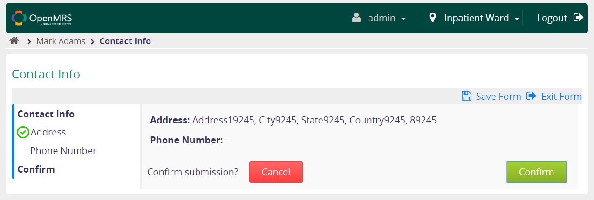

Note: The “Save Form” and “Exit Form” buttons can be used to close the form at
any time.

### Patient Overview screen

The Patient Overview screen has a lot of good information in it, and hopefully
it is easy enough to understand. If, however, you'd like more information,
please go to the OpenMRS [wiki
page](https://wiki.openmrs.org/pages/viewpage.action?pageId=221053347).

To get to the Patient Overview screen, click on Find Patient Record, search by
the patient's ID or name, then click on the patient.

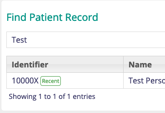

### Scheduling an Appointment

There are two ways to schedule an appointment: from the patient overview screen
or from the OpenMRS home screen. This section will explain both options.

To schedule a new patient appointment from the patient overview screen:

 1. On the right side of the screen under General Actions, click Schedule
 Appointment.
 1. At the bottom of the screen under the heading Schedule a New Appointment,
 begin typing in the Select Service Type box to search for the type of
 appointment, or click View all types to select the service type from a list.
 1. Select an appointment date by clicking the calendar icon in the date
 selection box on the left and picking a date from the calendar popup.
 1. Optionally, create a time frame to search for available appointment times
 by clicking the calendar icon in the date selection box on the right and
 picking an end date from the calendar popup.
 1. Select the desired time block from the list of results by clicking on the
 corresponding entry in the table of time blocks.
 1. Click Next at the bottom of the screen.
 1. Optionally, enter any desired additional notes for the health care
 provider.
 1. Click Save at the bottom of the screen to schedule the appointment.

To schedule a new patient appointment from the EHR home screen:

 1. On the OpenMRS home screen, click Appointment Scheduling.
 1. Click Manage Appointments. Note that Daily Appointments does not work, it
 is a bug and we hope to fix it soon.
 1. Search for the patient to schedule an appointment for by typing a name or
 patient ID into the search bar.
 1. Select the desired patient by clicking that patient's entry in the results
 table.
 1. Follow the instructions for a new patient appointment from the patient
 overview screen starting from step 2.

### Checking in a Patient

To check in a patient, navigate to the [Patient Overview
screen](#patient-overview-screen). Once there, click on Start Visit.

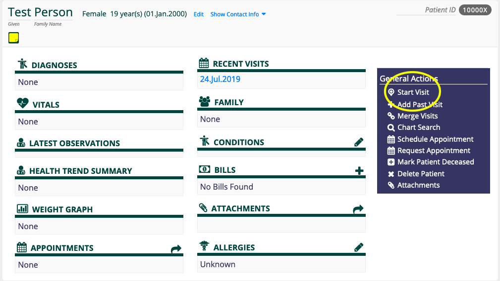

### Receiving Payment

To create a new bill, click on the Cashier button from the home screen, then
Cashier Tasks and finally Create new bill.

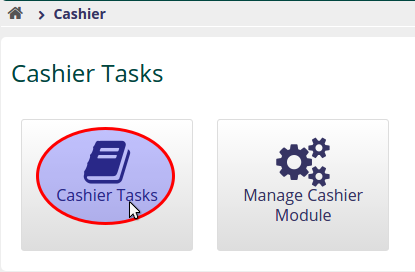

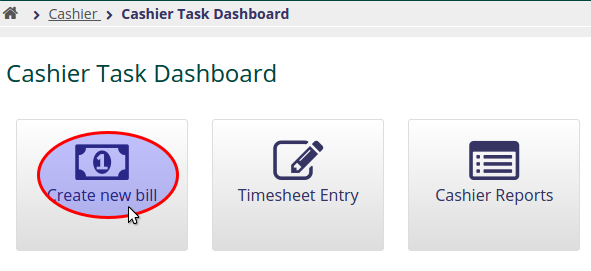

The bill screen can be divided into five sections:

1. Basic information
1. Patient selection
1. Line items
1. Payments
1. Operations

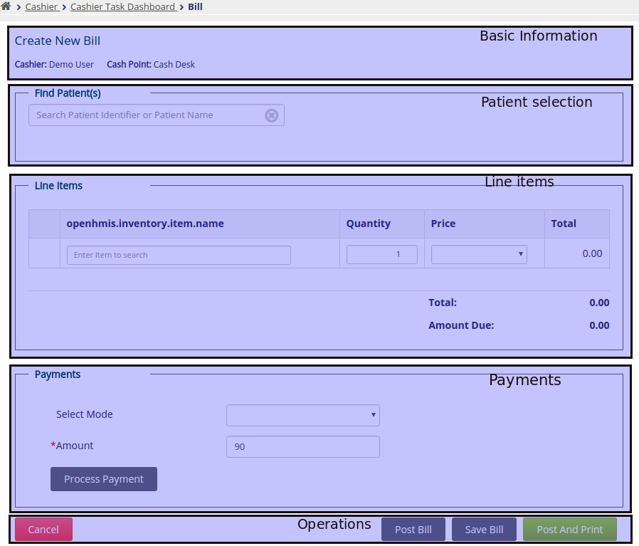

**Basic Information**

This section displays information such as the cashier and cash point associated
with the bill.  When viewing a saved bill, the receipt number and date of the
bill will also be shown.

**Patient Selection**

This section shows the patient associated with the bill.  If no patient has
been selected, or if the bill is being edited and a user wishes to change the
selected patient, it is possible to search for a patient by name or identifier
and select any existing patient.

**Line items: Adding and Editing**

The line items section of the bill screen displays all billable items for the
bill.  There is always a blank line at the end of the list which allows for the
entry of a new item.  Line items for a bill that has not been posted can also
be removed using the trash can at the left of the line.

To choose an item for a new line item entry, or to edit a previously chosen
item, begin typing the name or the identifier of the item.  With a search
string of at least three characters, the system will search the item inventory
and show a list of results. The desired result can be selected with the mouse
or by using the up/down arrow keys.

The changes to a line are validated and saved by pressing Enter or if the line
loses focus (i.e., when clicking another area of the screen).

A summary of the bill is displayed at the bottom of the line items section,
indicating the total of the line items, the total amount tendered by the
client, and the change due, if applicable.

**Payments and Payment Processing/Operations**

This is the section where payment information is recorded. A bill can be
settled using multiple payments or can be partially settled. Bills can be in
one of the following states:

1. **Pending:** The bill has all of the required information (i.e. patient, and
at least one line item) and has been saved.  Pending bills can be edited
without the need of a bill adjustment. A bill enters this state when you click
on "Save Bill" from the Bill Page.
1. **Posted:** The bill is automatically posted when the total of the
payment(s) processed is not equal to the bill's total. It can also be manually
posted using the "Post Bill" button.  Posted bills can be printed.
1. **Paid:** A posted bill is marked as paid when the total of the payments
processed is equal to (or greater than) the bill's total.  A paid bill can
still be adjusted.
1. **Adjusted:** A bill is marked as adjusted when a new bill is created to
adjust it.  The Bill Screen will indicate that a bill has been adjusted and
provide a link to the adjusting bill. Adjusted bills are stored for auditing
but can no longer be modified or printed from the Bill Screen.

## Caring for Patients

This section covers the basics of caring for patients, including taking vitals,
entering notes, and ordering tests and scans.

### Capturing Vitals

Before you can capture a patient's vitals, they must be checked in. See
[Checking in a Patient](#checking-in-a-patient). Once the patient is checked
in, click on Capture Vitals on the home page, search for the patient, and input
their vitals.

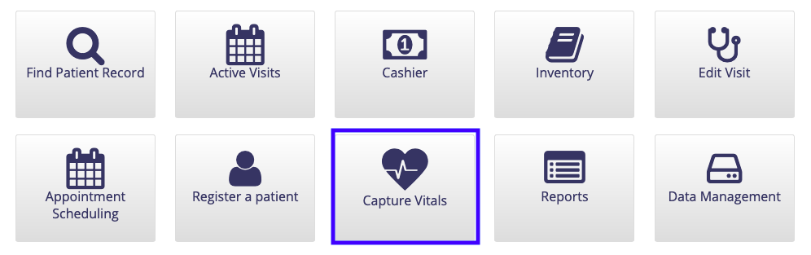

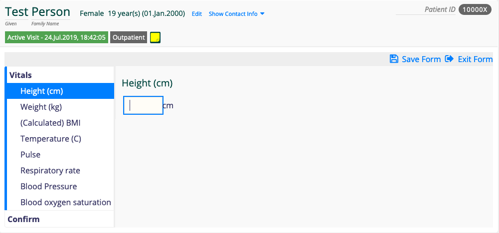
