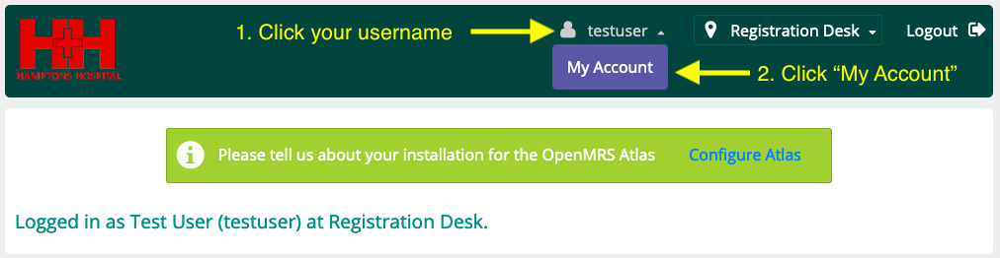
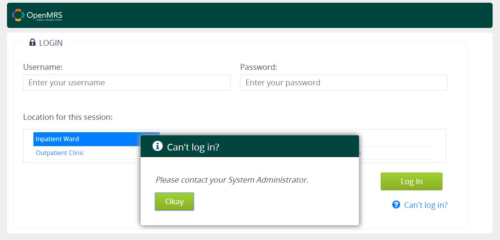

# Hamptons Hospital Electronic Health Records System User Manual

Hi, and welcome to the Hamptons Hospital Electronic Health Records
(EHR) System User Manual! If you want to help improve this manual,
[create a github account](https://github.com/join) if you don't
already have one, sign in to [github](https://github.com/), then go
[here](https://github.com/JasonMFry/hamptons_hospital_ehr_user_manual/edit/master/user_manual.md),
make changes, and finally click "Propose File Change" at the bottom
of the page. 

This user manual is for all members of the Hamptons Hospital who need to use the EHR system. Our EHR is powered by [OpenMRS](https://openmrs.org/), and this user manual is largely based on OpenMRS' [user manual](https://wiki.openmrs.org/display/docs/Using+the+Reference+Application).

## Getting Started

Before you can use the EHR system, you'll need to login. Below is
everything you need to know to log in, change your password, help if
you forget your password, and log out.

### Logging In

Before you can log in to the EHR you need someone else to create a
username and password for you. Your supervisor should know who to ask
to create a user for you, if you don't already have one.

Once you have a username and password, navigate to [the login
page](http://10.0.0.41:8080/openmrs/login.htm), input your username
and password, select a location (some locations have access to
certain information and actions that other locations don't, so pick
the location that most closely corresponds to where you are), and
click "Log In".

### Changing Your Password

The first thing you should do after logging is to change your
password. Please protect our patients, our co-workers, and our
hospital by choosing a strong password. I highly recommend navigating
to [random word generator](https://randomwordgenerator.com/) and let
it generate 3-5 random words for you as your password. You will need
to include a number and a capital letter.

To change your password, click on your username. This will create a
button called "My Account", click on that, then click on the large
button called "Change Password". After you have changed your
password, you are ready to use the EHR system!

### Forgot Your Password?

If you forgot your password, that's ok, we can reset it. However, it
may take several hours, so do your best to remember your password.
Unfortunately, our EHR system does not yet allow non-administrator
users to reset their passwords directly. In order to have your
password reset, contact your system administrator.

Clicking the "Can't Log In?" button on the login screen will display
a pop-up box prompting you to contact your local administrator,
which isn't very helpful :)

After you've had the system administrator reset your password, you should follow the instructions in [Changing Your Password](#changing-your-password).

### Updating Your Personal Profile

At this time, the only thing you can update in your personal profile is your password and your preferred language. We've already discussed changing your password, so if you want to change your language, follow these instructions, and consult the image in [Changing Your Password](#changing-your-password).

 1. Towards the top right of the page, click on your username next to the person icon.
 1. Click ‘My Account’ when it appears in the dropdown.
 1. Change your languages as necessary.
